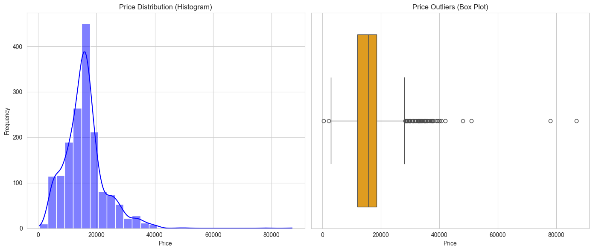
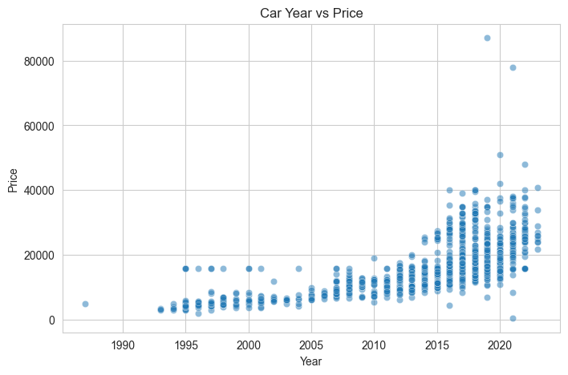
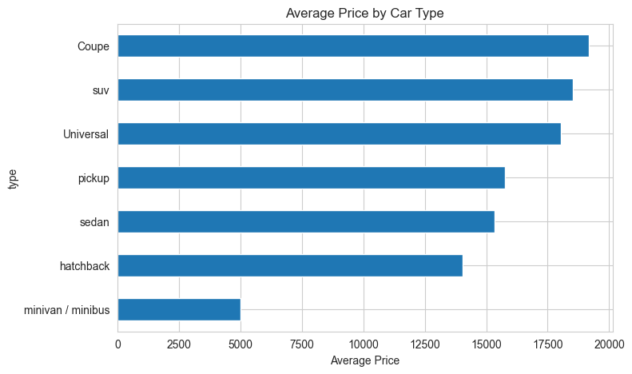
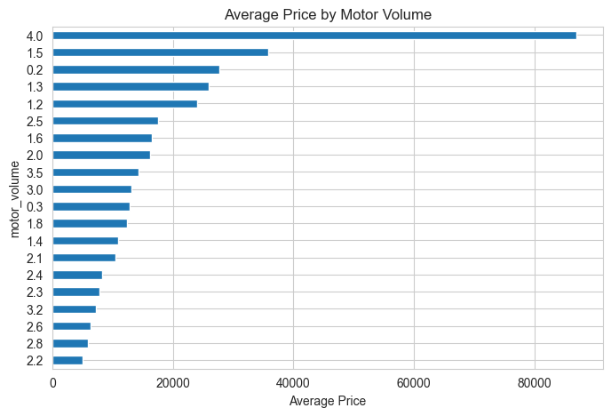
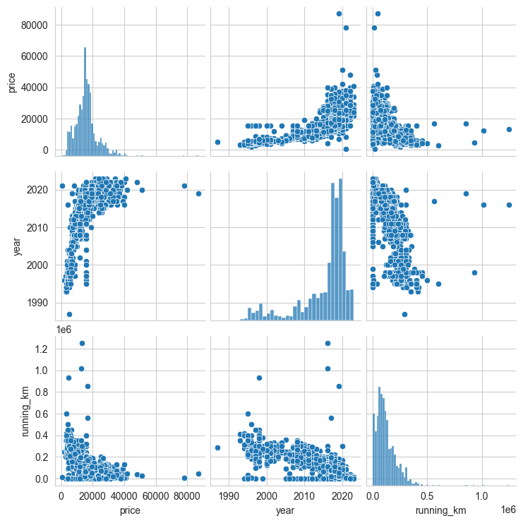
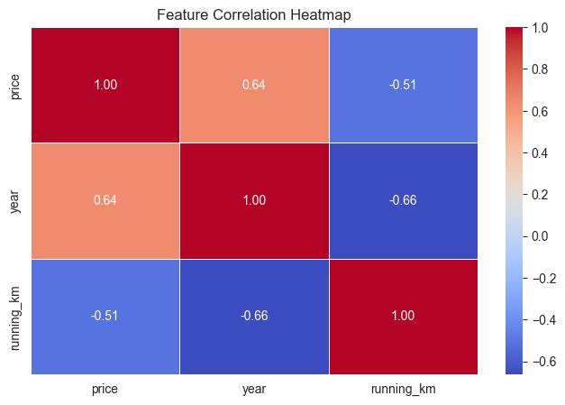
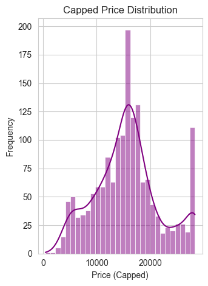

# Import packages


```python
import pandas as pd
import numpy as np
import matplotlib.pyplot as plt
import seaborn as sns
import joblib
from sklearn.linear_model import LinearRegression
from sklearn.tree import DecisionTreeRegressor
from sklearn.svm import SVR
from sklearn.metrics import mean_squared_error, r2_score
from sklearn.model_selection import GridSearchCV
```

# Load The Dataset

## Load Train Data


```python
trainData = pd.read_csv("input/train.csv")

print("Train Dataset shape:", trainData.shape)

print("\nTrain Dataset Info:\n")
trainData.info()

print("\nFirst 5 Rows of the Dataset:\n")
trainData.head()
```

    Train Dataset shape: (1642, 10)
    
    Train Dataset Info:
    
    <class 'pandas.core.frame.DataFrame'>
    RangeIndex: 1642 entries, 0 to 1641
    Data columns (total 10 columns):
     #   Column        Non-Null Count  Dtype  
    ---  ------        --------------  -----  
     0   model         1642 non-null   object 
     1   year          1642 non-null   int64  
     2   motor_type    1642 non-null   object 
     3   running       1642 non-null   object 
     4   wheel         1642 non-null   object 
     5   color         1642 non-null   object 
     6   type          1642 non-null   object 
     7   status        1642 non-null   object 
     8   motor_volume  1642 non-null   float64
     9   price         1642 non-null   int64  
    dtypes: float64(1), int64(2), object(7)
    memory usage: 128.4+ KB
    
    First 5 Rows of the Dataset:
    
    


<div>
<style scoped>
    .dataframe tbody tr th:only-of-type {
        vertical-align: middle;
    }

    .dataframe tbody tr th {
        vertical-align: top;
    }

    .dataframe thead th {
        text-align: right;
    }
</style>
<table border="1" class="dataframe">
  <thead>
    <tr style="text-align: right;">
      <th></th>
      <th>model</th>
      <th>year</th>
      <th>motor_type</th>
      <th>running</th>
      <th>wheel</th>
      <th>color</th>
      <th>type</th>
      <th>status</th>
      <th>motor_volume</th>
      <th>price</th>
    </tr>
  </thead>
  <tbody>
    <tr>
      <th>0</th>
      <td>toyota</td>
      <td>2022</td>
      <td>petrol</td>
      <td>3000  km</td>
      <td>left</td>
      <td>skyblue</td>
      <td>sedan</td>
      <td>excellent</td>
      <td>2.0</td>
      <td>24500</td>
    </tr>
    <tr>
      <th>1</th>
      <td>mercedes-benz</td>
      <td>2014</td>
      <td>petrol</td>
      <td>132000  km</td>
      <td>left</td>
      <td>black</td>
      <td>sedan</td>
      <td>excellent</td>
      <td>2.0</td>
      <td>25500</td>
    </tr>
    <tr>
      <th>2</th>
      <td>kia</td>
      <td>2018</td>
      <td>petrol</td>
      <td>95000  miles</td>
      <td>left</td>
      <td>other</td>
      <td>sedan</td>
      <td>excellent</td>
      <td>2.0</td>
      <td>11700</td>
    </tr>
    <tr>
      <th>3</th>
      <td>mercedes-benz</td>
      <td>2002</td>
      <td>petrol</td>
      <td>137000  miles</td>
      <td>left</td>
      <td>golden</td>
      <td>sedan</td>
      <td>excellent</td>
      <td>3.2</td>
      <td>12000</td>
    </tr>
    <tr>
      <th>4</th>
      <td>mercedes-benz</td>
      <td>2017</td>
      <td>petrol</td>
      <td>130000  km</td>
      <td>left</td>
      <td>black</td>
      <td>sedan</td>
      <td>good</td>
      <td>2.0</td>
      <td>26000</td>
    </tr>
  </tbody>
</table>
</div>


## Load Test Data


```python
testData = pd.read_csv("input/test.csv")

print("Test Dataset shape:", testData.shape)

print("\nTest Dataset Info:\n")
testData.info()

print("\nFirst 5 Rows of the Test Dataset:\n")
testData.head()
```

    Test Dataset shape: (411, 10)
    
    Test Dataset Info:
    
    <class 'pandas.core.frame.DataFrame'>
    RangeIndex: 411 entries, 0 to 410
    Data columns (total 10 columns):
     #   Column        Non-Null Count  Dtype  
    ---  ------        --------------  -----  
     0   Id            411 non-null    int64  
     1   model         411 non-null    object 
     2   year          411 non-null    int64  
     3   motor_type    411 non-null    object 
     4   running       411 non-null    object 
     5   wheel         411 non-null    object 
     6   color         411 non-null    object 
     7   type          411 non-null    object 
     8   status        411 non-null    object 
     9   motor_volume  411 non-null    float64
    dtypes: float64(1), int64(2), object(7)
    memory usage: 32.2+ KB
    
    First 5 Rows of the Test Dataset:
    
    


<div>
<style scoped>
    .dataframe tbody tr th:only-of-type {
        vertical-align: middle;
    }

    .dataframe tbody tr th {
        vertical-align: top;
    }

    .dataframe thead th {
        text-align: right;
    }
</style>
<table border="1" class="dataframe">
  <thead>
    <tr style="text-align: right;">
      <th></th>
      <th>Id</th>
      <th>model</th>
      <th>year</th>
      <th>motor_type</th>
      <th>running</th>
      <th>wheel</th>
      <th>color</th>
      <th>type</th>
      <th>status</th>
      <th>motor_volume</th>
    </tr>
  </thead>
  <tbody>
    <tr>
      <th>0</th>
      <td>0</td>
      <td>kia</td>
      <td>2020</td>
      <td>petrol</td>
      <td>24000  km</td>
      <td>left</td>
      <td>black</td>
      <td>sedan</td>
      <td>excellent</td>
      <td>2.0</td>
    </tr>
    <tr>
      <th>1</th>
      <td>1</td>
      <td>nissan</td>
      <td>2017</td>
      <td>petrol</td>
      <td>85000  miles</td>
      <td>left</td>
      <td>white</td>
      <td>suv</td>
      <td>excellent</td>
      <td>2.0</td>
    </tr>
    <tr>
      <th>2</th>
      <td>2</td>
      <td>hyundai</td>
      <td>2021</td>
      <td>petrol</td>
      <td>30000  miles</td>
      <td>left</td>
      <td>white</td>
      <td>sedan</td>
      <td>excellent</td>
      <td>2.0</td>
    </tr>
    <tr>
      <th>3</th>
      <td>3</td>
      <td>kia</td>
      <td>2018</td>
      <td>petrol</td>
      <td>53000  miles</td>
      <td>left</td>
      <td>silver</td>
      <td>sedan</td>
      <td>excellent</td>
      <td>2.0</td>
    </tr>
    <tr>
      <th>4</th>
      <td>4</td>
      <td>mercedes-benz</td>
      <td>2003</td>
      <td>petrol</td>
      <td>230000  km</td>
      <td>left</td>
      <td>black</td>
      <td>Universal</td>
      <td>normal</td>
      <td>1.8</td>
    </tr>
  </tbody>
</table>
</div>


# Data Preprocessing

## Check for missing values in Train Dataset


```python
missing_values = trainData.isnull().sum()
missing_percentage = (missing_values / len(trainData)) * 100

missing_df = pd.DataFrame({"Missing Count": missing_values, "Missing %": missing_percentage})
missing_df = missing_df[missing_df["Missing Count"] > 0]

# Display results
if missing_df.empty:
    print("No Missing Values in Train Dataset!")
else:
    print("Missing Values Found in Train Dataset:\n")
    print(missing_df.sort_values(by="Missing %", ascending=False))

```

    No Missing Values in Train Dataset!
    

## Handle numerical missing values (in-case if any in future)


```python
numerical_columns = trainData.select_dtypes(include=['int64', 'float64']).columns

# Fill missing values with median
trainData[numerical_columns] = trainData[numerical_columns].apply(lambda col: col.fillna(col.median()))

missing_numerical = trainData[numerical_columns].isnull().sum()

if missing_numerical.sum() == 0:
    print("No missing values remain in numerical columns!")
else:
    print("Some numerical columns still have missing values:\n", missing_numerical)
```

    No missing values remain in numerical columns!
    

## Handle categorical missing values (in-case if any in future)


```python
categorical_columns = trainData.select_dtypes(include=['object']).columns

# Fill missing values with most frequent value
trainData[categorical_columns] = trainData[categorical_columns].apply(lambda col: col.fillna(col.mode()[0]))

missing_categorical = trainData[categorical_columns].isnull().sum()

if missing_categorical.sum() == 0:
    print("No missing values remain in categorical columns!")
else:
    print("Some categorical columns still have missing values:\n", missing_categorical)
```

    No missing values remain in categorical columns!
    

## Convert Units in Train Dataset


```python
# Function to clean and convert running column
def convert_running(value):
    value = value.lower().replace(",", "").strip()
    if "miles" in value:
        num = float(value.replace("miles", "").strip()) * 1.60934  # Convert miles to km
    elif "km" in value:
        num = float(value.replace("km", "").strip())
    else:
        num = np.nan
    return num

# Apply conversion function to running column
trainData["running_km"] = trainData["running"].apply(convert_running)

trainData.drop(columns=["running"], inplace=True)

# Display the cleaned column
trainData[["running_km"]].head()
```


<div>
<style scoped>
    .dataframe tbody tr th:only-of-type {
        vertical-align: middle;
    }

    .dataframe tbody tr th {
        vertical-align: top;
    }

    .dataframe thead th {
        text-align: right;
    }
</style>
<table border="1" class="dataframe">
  <thead>
    <tr style="text-align: right;">
      <th></th>
      <th>running_km</th>
    </tr>
  </thead>
  <tbody>
    <tr>
      <th>0</th>
      <td>3000.00</td>
    </tr>
    <tr>
      <th>1</th>
      <td>132000.00</td>
    </tr>
    <tr>
      <th>2</th>
      <td>152887.30</td>
    </tr>
    <tr>
      <th>3</th>
      <td>220479.58</td>
    </tr>
    <tr>
      <th>4</th>
      <td>130000.00</td>
    </tr>
  </tbody>
</table>
</div>


## Convert Units in Test Dataset


```python
testData["running_km"] = testData["running"].apply(convert_running)
testData.drop(columns=["running"], inplace=True)
testData[["running_km"]].head()
```


<div>
<style scoped>
    .dataframe tbody tr th:only-of-type {
        vertical-align: middle;
    }

    .dataframe tbody tr th {
        vertical-align: top;
    }

    .dataframe thead th {
        text-align: right;
    }
</style>
<table border="1" class="dataframe">
  <thead>
    <tr style="text-align: right;">
      <th></th>
      <th>running_km</th>
    </tr>
  </thead>
  <tbody>
    <tr>
      <th>0</th>
      <td>24000.00</td>
    </tr>
    <tr>
      <th>1</th>
      <td>136793.90</td>
    </tr>
    <tr>
      <th>2</th>
      <td>48280.20</td>
    </tr>
    <tr>
      <th>3</th>
      <td>85295.02</td>
    </tr>
    <tr>
      <th>4</th>
      <td>230000.00</td>
    </tr>
  </tbody>
</table>
</div>


## Encode categorical variables


```python
# List of categorical columns
categorical_columns = ["model", "motor_type", "wheel", "color", "type", "status"]

# Apply One-Hot Encoding for categorical features
train_encoded = pd.get_dummies(trainData, columns=categorical_columns, drop_first=True)
test_encoded = pd.get_dummies(testData, columns=categorical_columns, drop_first=True)

# Align columns to ensure both datasets have the same features
train_encoded, test_encoded = train_encoded.align(test_encoded, join='left', axis=1, fill_value=0)

train_encoded.info()
train_encoded.head()
```

    <class 'pandas.core.frame.DataFrame'>
    RangeIndex: 1642 entries, 0 to 1641
    Data columns (total 38 columns):
     #   Column                     Non-Null Count  Dtype  
    ---  ------                     --------------  -----  
     0   year                       1642 non-null   int64  
     1   motor_volume               1642 non-null   float64
     2   price                      1642 non-null   int64  
     3   running_km                 1642 non-null   float64
     4   model_kia                  1642 non-null   bool   
     5   model_mercedes-benz        1642 non-null   bool   
     6   model_nissan               1642 non-null   bool   
     7   model_toyota               1642 non-null   bool   
     8   motor_type_gas             1642 non-null   bool   
     9   motor_type_hybrid          1642 non-null   bool   
     10  motor_type_petrol          1642 non-null   bool   
     11  motor_type_petrol and gas  1642 non-null   bool   
     12  color_black                1642 non-null   bool   
     13  color_blue                 1642 non-null   bool   
     14  color_brown                1642 non-null   bool   
     15  color_cherry               1642 non-null   bool   
     16  color_clove                1642 non-null   bool   
     17  color_golden               1642 non-null   bool   
     18  color_gray                 1642 non-null   bool   
     19  color_green                1642 non-null   bool   
     20  color_orange               1642 non-null   bool   
     21  color_other                1642 non-null   bool   
     22  color_pink                 1642 non-null   bool   
     23  color_purple               1642 non-null   bool   
     24  color_red                  1642 non-null   bool   
     25  color_silver               1642 non-null   bool   
     26  color_skyblue              1642 non-null   bool   
     27  color_white                1642 non-null   bool   
     28  type_Universal             1642 non-null   bool   
     29  type_hatchback             1642 non-null   bool   
     30  type_minivan / minibus     1642 non-null   bool   
     31  type_pickup                1642 non-null   bool   
     32  type_sedan                 1642 non-null   bool   
     33  type_suv                   1642 non-null   bool   
     34  status_excellent           1642 non-null   bool   
     35  status_good                1642 non-null   bool   
     36  status_new                 1642 non-null   bool   
     37  status_normal              1642 non-null   bool   
    dtypes: bool(34), float64(2), int64(2)
    memory usage: 106.0 KB
    


<div>
<style scoped>
    .dataframe tbody tr th:only-of-type {
        vertical-align: middle;
    }

    .dataframe tbody tr th {
        vertical-align: top;
    }

    .dataframe thead th {
        text-align: right;
    }
</style>
<table border="1" class="dataframe">
  <thead>
    <tr style="text-align: right;">
      <th></th>
      <th>year</th>
      <th>motor_volume</th>
      <th>price</th>
      <th>running_km</th>
      <th>model_kia</th>
      <th>model_mercedes-benz</th>
      <th>model_nissan</th>
      <th>model_toyota</th>
      <th>motor_type_gas</th>
      <th>motor_type_hybrid</th>
      <th>...</th>
      <th>type_Universal</th>
      <th>type_hatchback</th>
      <th>type_minivan / minibus</th>
      <th>type_pickup</th>
      <th>type_sedan</th>
      <th>type_suv</th>
      <th>status_excellent</th>
      <th>status_good</th>
      <th>status_new</th>
      <th>status_normal</th>
    </tr>
  </thead>
  <tbody>
    <tr>
      <th>0</th>
      <td>2022</td>
      <td>2.0</td>
      <td>24500</td>
      <td>3000.00</td>
      <td>False</td>
      <td>False</td>
      <td>False</td>
      <td>True</td>
      <td>False</td>
      <td>False</td>
      <td>...</td>
      <td>False</td>
      <td>False</td>
      <td>False</td>
      <td>False</td>
      <td>True</td>
      <td>False</td>
      <td>True</td>
      <td>False</td>
      <td>False</td>
      <td>False</td>
    </tr>
    <tr>
      <th>1</th>
      <td>2014</td>
      <td>2.0</td>
      <td>25500</td>
      <td>132000.00</td>
      <td>False</td>
      <td>True</td>
      <td>False</td>
      <td>False</td>
      <td>False</td>
      <td>False</td>
      <td>...</td>
      <td>False</td>
      <td>False</td>
      <td>False</td>
      <td>False</td>
      <td>True</td>
      <td>False</td>
      <td>True</td>
      <td>False</td>
      <td>False</td>
      <td>False</td>
    </tr>
    <tr>
      <th>2</th>
      <td>2018</td>
      <td>2.0</td>
      <td>11700</td>
      <td>152887.30</td>
      <td>True</td>
      <td>False</td>
      <td>False</td>
      <td>False</td>
      <td>False</td>
      <td>False</td>
      <td>...</td>
      <td>False</td>
      <td>False</td>
      <td>False</td>
      <td>False</td>
      <td>True</td>
      <td>False</td>
      <td>True</td>
      <td>False</td>
      <td>False</td>
      <td>False</td>
    </tr>
    <tr>
      <th>3</th>
      <td>2002</td>
      <td>3.2</td>
      <td>12000</td>
      <td>220479.58</td>
      <td>False</td>
      <td>True</td>
      <td>False</td>
      <td>False</td>
      <td>False</td>
      <td>False</td>
      <td>...</td>
      <td>False</td>
      <td>False</td>
      <td>False</td>
      <td>False</td>
      <td>True</td>
      <td>False</td>
      <td>True</td>
      <td>False</td>
      <td>False</td>
      <td>False</td>
    </tr>
    <tr>
      <th>4</th>
      <td>2017</td>
      <td>2.0</td>
      <td>26000</td>
      <td>130000.00</td>
      <td>False</td>
      <td>True</td>
      <td>False</td>
      <td>False</td>
      <td>False</td>
      <td>False</td>
      <td>...</td>
      <td>False</td>
      <td>False</td>
      <td>False</td>
      <td>False</td>
      <td>True</td>
      <td>False</td>
      <td>False</td>
      <td>True</td>
      <td>False</td>
      <td>False</td>
    </tr>
  </tbody>
</table>
<p>5 rows × 38 columns</p>
</div>


# Exploratory Data Analysis (EDA) On Train Dataset

1642 rows, 10 columns

**Target variable** - price

**Feature Columns:**

Categorical: model, motor_type, running, wheel, color, type, status

Numerical: year, motor_volume


```python
print()
```

    
    

## Distribution of the Target Variable


```python
plt.figure(figsize=(14, 6))

# Histogram for Price Distribution
plt.subplot(1, 2, 1)
sns.histplot(trainData["price"], bins=30, kde=True, color="blue")
plt.title("Price Distribution (Histogram)")
plt.xlabel("Price")
plt.ylabel("Frequency")

# Boxplot for Identifying Outliers
plt.subplot(1, 2, 2)
sns.boxplot(x=trainData["price"], color="orange")
plt.title("Price Outliers (Box Plot)")
plt.xlabel("Price")

# Show Plots
plt.tight_layout()
plt.show()
```


    

    


### Histogram Analysis
##### The histogram shows a right-skewed distribution, meaning that most car prices are lower, but there are some cars with very high prices.
##### This suggests that a log transformation could help normalize the distribution, making it easier for the model to learn.

### Box Plot Analysis
##### The box plot clearly shows extreme outliers at the higher end of the price range.
##### These high prices could negatively impact model performance, as Random Forest models are affected by extreme values.

## Feature-Target Relationship

### Year vs Price


```python
plt.figure(figsize=(8, 5))
sns.scatterplot(x=trainData["year"], y=trainData["price"], alpha=0.5)
plt.title("Car Year vs Price")
plt.xlabel("Year")
plt.ylabel("Price")
plt.show()
```


    

    


### Type vs Price


```python
types = trainData.groupby("type")["price"].mean().sort_values()

types.plot(kind="barh", figsize=(8, 5), title="Average Price by Car Type")
plt.xlabel("Average Price")
plt.show()
```


    

    


### Moto volume vs Price


```python
types = trainData.groupby("motor_volume")["price"].mean().sort_values()

types.plot(kind="barh", figsize=(8, 5), title="Average Price by Motor Volume")
plt.xlabel("Average Price")
plt.show()
```


    

    


```python
types = trainData.groupby("motor_volume")["price"].mean().sort_values()

types.plot(kind="barh", figsize=(8, 5), title="Average Price by Motor Volume")
plt.xlabel("Average Price")
plt.show()
```


    

    


## Feature Relationships (Numerical Features)


```python
selected_features = ["price", "year", "running_km"]
sns.pairplot(trainData[selected_features])
plt.show()
```


    

    


## Correlation Analysis (Numerical Features)


```python
plt.figure(figsize=(8, 5))
sns.heatmap(trainData[selected_features].corr(), annot=True, cmap="coolwarm", fmt=".2f", linewidths=0.5)
plt.title("Feature Correlation Heatmap")
plt.show()
```


    

    


## Apply Cap outliers to the price


```python
# Identify Outliers using IQR method
Q1 = train_encoded["price"].quantile(0.25)
Q3 = train_encoded["price"].quantile(0.75)
IQR = Q3 - Q1

lower_bound = Q1 - 1.5 * IQR
upper_bound = Q3 + 1.5 * IQR

train_encoded["price_capped"] = np.where(train_encoded["price"] > upper_bound, upper_bound, train_encoded["price"])

# Capped Price Histogram
plt.subplot(1, 2, 2)
sns.histplot(train_encoded["price_capped"], bins=30, kde=True, color="purple")
plt.title("Capped Price Distribution")
plt.xlabel("Price (Capped)")
plt.ylabel("Frequency")

# Show Plots
plt.tight_layout()
plt.show()

train_encoded[["price_capped"]].describe()
```


    

    


<div>
<style scoped>
    .dataframe tbody tr th:only-of-type {
        vertical-align: middle;
    }

    .dataframe tbody tr th {
        vertical-align: top;
    }

    .dataframe thead th {
        text-align: right;
    }
</style>
<table border="1" class="dataframe">
  <thead>
    <tr style="text-align: right;">
      <th></th>
      <th>price_capped</th>
    </tr>
  </thead>
  <tbody>
    <tr>
      <th>count</th>
      <td>1642.000000</td>
    </tr>
    <tr>
      <th>mean</th>
      <td>15634.735688</td>
    </tr>
    <tr>
      <th>std</th>
      <td>6062.471053</td>
    </tr>
    <tr>
      <th>min</th>
      <td>462.000000</td>
    </tr>
    <tr>
      <th>25%</th>
      <td>12000.000000</td>
    </tr>
    <tr>
      <th>50%</th>
      <td>15750.000000</td>
    </tr>
    <tr>
      <th>75%</th>
      <td>18500.000000</td>
    </tr>
    <tr>
      <th>max</th>
      <td>28250.000000</td>
    </tr>
  </tbody>
</table>
</div>


```python

```

# Model Training

## Feature Selection


```python
from sklearn.model_selection import train_test_split
from sklearn.ensemble import RandomForestRegressor
from sklearn.metrics import mean_absolute_error


X = train_encoded.drop(columns=["price", "price_capped"])
y = train_encoded["price_capped"]

# Training (80%), Testing (20%)
X_train, X_val, y_train, y_val = train_test_split(X, y, test_size=0.2, random_state=42)
```

## Performance Comparison and Model selection


```python
models = {
    "Random Forest": RandomForestRegressor(n_estimators=200, max_depth=20, random_state=42),
    "Linear Regression": LinearRegression(),
    "Decision Tree": DecisionTreeRegressor(random_state=42),
    "Support Vector Regressor (SVR)": SVR()
}

results = {}

for model_name, model in models.items():

    model.fit(X_train, y_train)
    y_pred = model.predict(X_val)

    mae = mean_absolute_error(y_val, y_pred)
    mse = mean_squared_error(y_val, y_pred)
    rmse = np.sqrt(mse)
    r2 = r2_score(y_val, y_pred)

    results[model_name] = [mae, mse, rmse, r2]

# Convert results to DataFrame and display
results_df = pd.DataFrame(results, index=["MAE", "MSE", "RMSE", "R² Score"]).T
print("Model Performance Comparison:\n")
print(results_df)

```

    Model Performance Comparison:
    
                                            MAE           MSE         RMSE  \
    Random Forest                   1902.349589  8.798545e+06  2966.234090   
    Linear Regression               2304.151003  1.037675e+07  3221.295860   
    Decision Tree                   2451.440729  1.479260e+07  3846.114547   
    Support Vector Regressor (SVR)  4424.020386  3.453961e+07  5877.041089   
    
                                    R² Score  
    Random Forest                   0.751815  
    Linear Regression               0.707297  
    Decision Tree                   0.582737  
    Support Vector Regressor (SVR)  0.025722  
    

##### Random Forest Regressor has outperformed the other models, achieved the lowest MAE (1902.35) and highest R² Score (0.7518). This confirms that Random Forest is the best model for car price prediction.

## Hyper parameter tuning for Random Forest


```python
# param_grid = {
#     'n_estimators': [100, 200, 300],
#     'max_depth': [10, 20, 30, None],
#     'min_samples_split': [2, 5, 10],
#     'min_samples_leaf': [1, 2, 4],
#     'max_features': ['sqrt', 'log2']
# }
#
# # Initialize the model
# rf = RandomForestRegressor(random_state=42)
#
# # Initialize GridSearchCV
# grid_search = GridSearchCV(
#     estimator=rf,
#     param_grid=param_grid,
#     scoring='neg_mean_absolute_error',
#     cv=5,
#     n_jobs=-1,
#     verbose=2
# )
#
# # Fit GridSearchCV
# grid_search.fit(X_train, y_train)
#
# # Print best parameters
# print("Best Parameters:", grid_search.best_params_)
#
# # Train the model with the best parameters
# best_rf = RandomForestRegressor(**grid_search.best_params_, random_state=42)
# best_rf.fit(X_train, y_train)
#
# # Evaluate on test set
# y_pred = best_rf.predict(X_val)
#
# from sklearn.metrics import mean_absolute_error, mean_squared_error, r2_score
# mae = mean_absolute_error(y_val, y_pred)
# mse = mean_squared_error(y_val, y_pred)
# rmse = mse ** 0.5
# r2 = r2_score(y_val, y_pred)
#
# print(f"MAE: {mae}")
# print(f"MSE: {mse}")
# print(f"RMSE: {rmse}")
# print(f"R² Score: {r2}")
```


```python

```


## Train and Save Random Forest Regressor


```python
best_rf = RandomForestRegressor(n_estimators=200, max_depth=20, random_state=42)
best_rf.fit(X_train, y_train)

model_path = "model/random_forest_model.pkl"
joblib.dump(best_rf, model_path)
print(f"Model saved successfully as {model_path}")
```

    Model saved successfully as model/random_forest_model.pkl
    

# Predict prices of test.csv


```python
test_encoded = test_encoded[X.columns]

test_predictions = best_rf.predict(test_encoded)

submission_df = pd.DataFrame({"Id": testData["Id"], "Predicted Price": test_predictions})
submission_df["Predicted Price"] = submission_df["Predicted Price"].round().astype(int)

submission_path = "output/submission.csv"
submission_df.to_csv(submission_path, index=False)

print("Submission file generated at {}".format(submission_path))
submission_df
```

    Submission file generated at output/submission.csv
    


<div>
<style scoped>
    .dataframe tbody tr th:only-of-type {
        vertical-align: middle;
    }

    .dataframe tbody tr th {
        vertical-align: top;
    }

    .dataframe thead th {
        text-align: right;
    }
</style>
<table border="1" class="dataframe">
  <thead>
    <tr style="text-align: right;">
      <th></th>
      <th>Id</th>
      <th>Predicted Price</th>
    </tr>
  </thead>
  <tbody>
    <tr>
      <th>0</th>
      <td>0</td>
      <td>18079</td>
    </tr>
    <tr>
      <th>1</th>
      <td>1</td>
      <td>16091</td>
    </tr>
    <tr>
      <th>2</th>
      <td>2</td>
      <td>25210</td>
    </tr>
    <tr>
      <th>3</th>
      <td>3</td>
      <td>14661</td>
    </tr>
    <tr>
      <th>4</th>
      <td>4</td>
      <td>10007</td>
    </tr>
    <tr>
      <th>...</th>
      <td>...</td>
      <td>...</td>
    </tr>
    <tr>
      <th>406</th>
      <td>406</td>
      <td>23134</td>
    </tr>
    <tr>
      <th>407</th>
      <td>407</td>
      <td>15379</td>
    </tr>
    <tr>
      <th>408</th>
      <td>408</td>
      <td>15075</td>
    </tr>
    <tr>
      <th>409</th>
      <td>409</td>
      <td>14403</td>
    </tr>
    <tr>
      <th>410</th>
      <td>410</td>
      <td>13188</td>
    </tr>
  </tbody>
</table>
<p>411 rows × 2 columns</p>
</div>


